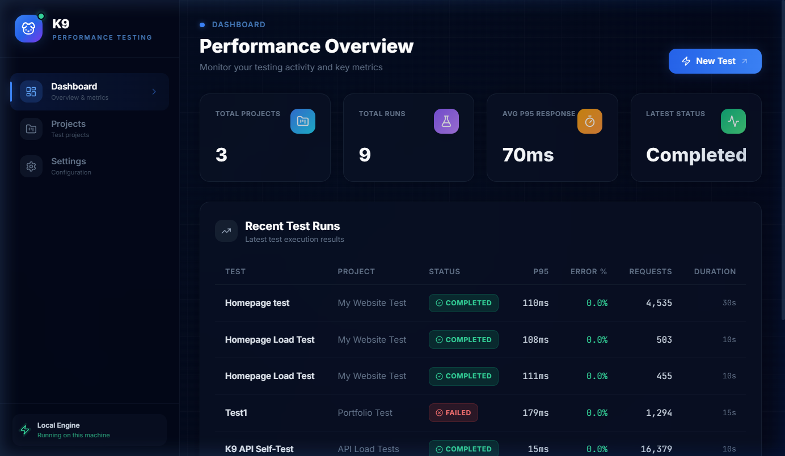
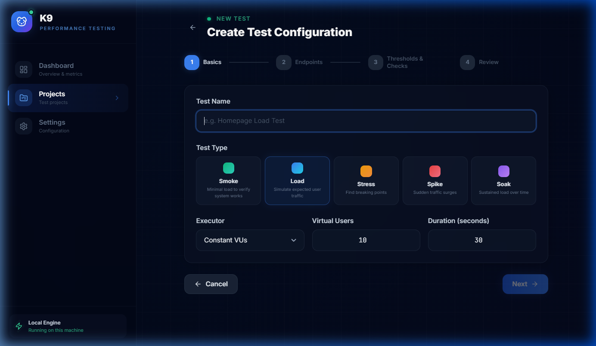
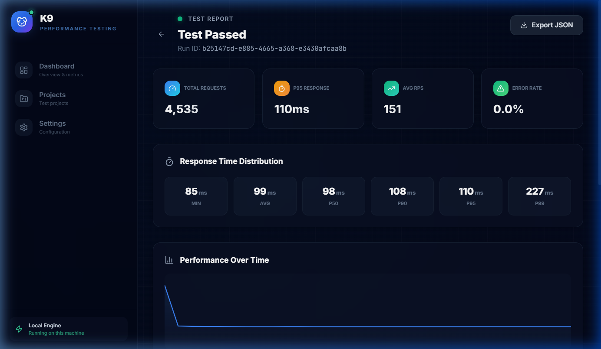
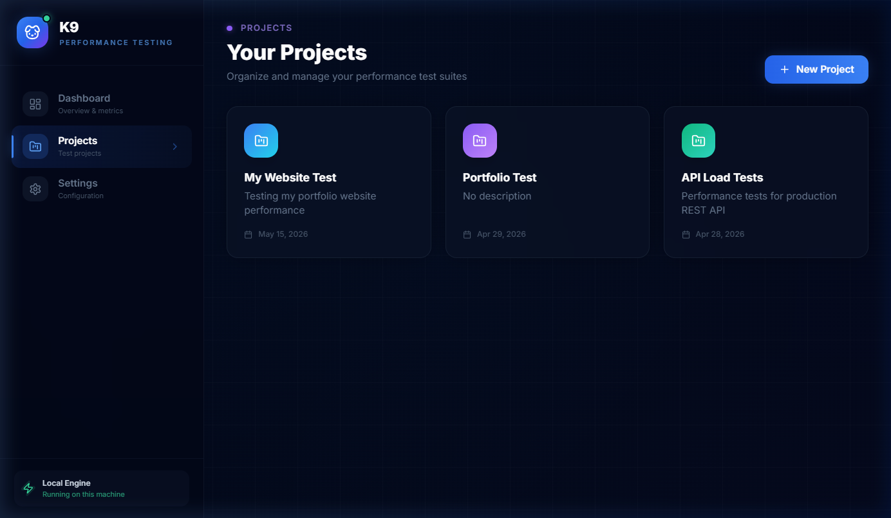
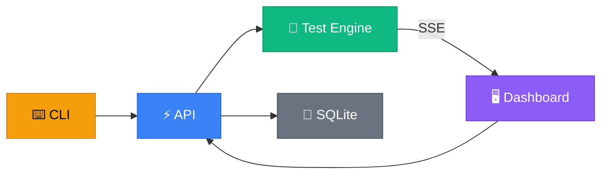

<p align="center">
  
</p>

<h1 align="center">K9</h1>

<p align="center">
  <strong>Local-first performance testing platform</strong><br />
  <sub>CLI + API + Dashboard — zero cloud dependencies, full control.</sub>
</p>

<p align="center">
  
  
  
  
  
</p>

---

## What is K9?

**K9** is a developer-first performance testing platform that runs entirely on your machine. No SaaS subscriptions, no cloud accounts — just fast, reliable load testing with a beautiful web dashboard and a powerful CLI.

Think of it as a modern, self-hosted alternative to tools like k6 or Grafana Cloud — designed for developers who want full ownership of their testing pipeline.

### ✨ Key Features

- **🖥️ Web Dashboard** — Real-time metrics, interactive charts, project management, and detailed test reports
- **⌨️ CLI Runner** — Run tests from the terminal with JSON config files, CI-friendly output
- **📊 Live Metrics** — SSE-powered real-time streaming of P50/P90/P95/P99, RPS, error rates during test execution
- **🔬 Test Types** — Smoke, Load, Stress, Spike, and Soak testing with configurable executors
- **🎯 Thresholds & Checks** — Define pass/fail criteria for automated quality gates
- **📈 Historical Data** — All test runs are persisted locally in SQLite for trend analysis
- **🏗️ Project Organization** — Group tests by project for better organization
- **⚡ High-Performance Engine** — Async in-process concurrency with connection pooling for maximum throughput

---

## Screenshots

<p align="center">
  
  <br />
  <sub><strong>Dashboard</strong> — Performance overview with stats and recent test runs</sub>
</p>

<p align="center">
  
  <br />
  <sub><strong>Create Test</strong> — Configure test type, virtual users, duration, and endpoints</sub>
</p>

<p align="center">
  
  <br />
  <sub><strong>Test Report</strong> — Detailed results with response time distribution and charts</sub>
</p>

<p align="center">
  
  <br />
  <sub><strong>Projects</strong> — Organize and manage your test suites</sub>
</p>

---

## Architecture

K9 is a **pnpm monorepo** with three apps and a shared package:

```
k9/
├── apps/
│   ├── api/         → Fastify REST API + test engine (port 3001)
│   ├── cli/         → Terminal-based test runner
│   └── web/         → React + Vite dashboard (port 5173)
├── packages/
│   └── shared/      → Shared types, constants, and contracts
├── prisma/          → SQLite schema (Prisma ORM)
└── examples/        → Sample test configurations
```



| Component | Tech Stack |
|-----------|-----------|
| **API** | Fastify 5, Prisma, Pino, Zod |
| **Web** | React 19, Vite, TanStack Query, Recharts, Zustand, Tailwind CSS |
| **CLI** | Node.js native `http`/`https`, zero dependencies |
| **Shared** | TypeScript types & constants |
| **Database** | SQLite (via Prisma) — zero setup |

---

## Quick Start

### Prerequisites

- **Node.js** ≥ 20.0.0
- **pnpm** ≥ 9 (`npm install -g pnpm`)

### Setup

```bash
# 1. Clone the repo
git clone https://github.com/AbdulrahmanAlaasi/K9.git
cd K9

# 2. Install dependencies
pnpm install

# 3. Initialize the database
pnpm db:generate
pnpm db:push

# 4. Start everything (API + Dashboard)
pnpm dev
```

The dashboard will be available at **http://localhost:5173** and the API at **http://localhost:3001**.

---

## Usage

### 🖥️ Web Dashboard

The dashboard provides a full GUI experience:

1. **Dashboard** — Overview of all projects, recent runs, and aggregate metrics
2. **Projects** — Create and manage test projects
3. **Create Test** — Configure test parameters, endpoints, thresholds, and checks
4. **Live Runner** — Watch tests execute in real-time with streaming charts
5. **Test Reports** — Detailed post-run analysis with percentile breakdowns
6. **Settings** — Configure safety limits (max VUs, max duration, etc.)

### ⌨️ CLI

Run performance tests directly from your terminal:

```bash
# Run a test from a config file
pnpm k9 run examples/load-test.json

# Override virtual users and duration
pnpm k9 run examples/load-test.json --vus 50 --duration 120

# Show help
pnpm k9 --help
```

**Example CLI output:**

```
  ╔═══╗
  ║ K9 ║  Performance Testing CLI
  ╚═══╝  v0.1.0

  ─────────────────────────────────────────────

  Test:      Example Load Test
  Type:      load
  VUs:       5
  Duration:  10s
  Endpoints: 2

  ▶ Starting test...

  ═══════════════════════════════════════════
    K9 Test Results
  ═══════════════════════════════════════════

  Total Requests:    1,247
  Failed Requests:   0
  Error Rate:        0.00%
  Duration:          10.1s
  Virtual Users:     5
  Avg RPS:           123

  Response Times:
    Avg:  81ms
    Min:  12ms
    P50:  72ms
    P90:  145ms
    P95:  189ms
    P99:  312ms
    Max:  456ms

  Thresholds:
    ✓ p95 lt 2000 (actual: 189)
    ✓ errorRate lt 0.1 (actual: 0)

  ALL THRESHOLDS PASSED
```

---

## Test Configuration

Tests are defined as JSON files:

```json
{
  "name": "My API Load Test",
  "testType": "load",
  "virtualUsers": 10,
  "duration": 30,
  "endpoints": [
    {
      "url": "https://api.example.com/health",
      "method": "GET"
    },
    {
      "url": "https://api.example.com/data",
      "method": "POST",
      "body": "{\"key\": \"value\"}",
      "bodyType": "json",
      "headers": {
        "Authorization": "Bearer token123"
      }
    }
  ],
  "thresholds": [
    { "metric": "p95", "operator": "lt", "value": 500 },
    { "metric": "errorRate", "operator": "lt", "value": 0.05 },
    { "metric": "avgResponseTime", "operator": "lt", "value": 200 }
  ]
}
```

### Configuration Reference

| Field | Type | Default | Description |
|-------|------|---------|-------------|
| `name` | `string` | — | Test name |
| `testType` | `string` | `"load"` | One of: `smoke`, `load`, `stress`, `spike`, `soak` |
| `virtualUsers` | `number` | `10` | Concurrent virtual users |
| `duration` | `number` | `30` | Test duration in seconds |
| `endpoints` | `Endpoint[]` | — | Target endpoints to test |
| `thresholds` | `Threshold[]` | `[]` | Pass/fail criteria |

### Threshold Metrics

| Metric | Description |
|--------|-------------|
| `p50` | 50th percentile response time (ms) |
| `p90` | 90th percentile response time (ms) |
| `p95` | 95th percentile response time (ms) |
| `p99` | 99th percentile response time (ms) |
| `avgResponseTime` | Average response time (ms) |
| `errorRate` | Ratio of failed requests (0–1) |
| `requestsPerSecond` | Throughput |

### Threshold Operators

| Operator | Meaning |
|----------|---------|
| `lt` | Less than |
| `gt` | Greater than |
| `lte` | Less than or equal |
| `gte` | Greater than or equal |

---

## API Reference

The REST API runs on port **3001** by default.

| Method | Endpoint | Description |
|--------|----------|-------------|
| `GET` | `/api/health` | Health check |
| `GET` | `/api/dashboard/stats` | Dashboard aggregate stats |
| `GET` | `/api/projects` | List all projects |
| `POST` | `/api/projects` | Create a project |
| `GET` | `/api/projects/:id` | Get project details |
| `PUT` | `/api/projects/:id` | Update a project |
| `DELETE` | `/api/projects/:id` | Delete a project |
| `GET` | `/api/projects/:id/tests` | List tests for a project |
| `POST` | `/api/tests` | Create a test configuration |
| `POST` | `/api/runs` | Start a test run |
| `GET` | `/api/runs/:id` | Get run details |
| `GET` | `/api/runs/:id/stream` | SSE stream for live metrics |
| `POST` | `/api/runs/:id/cancel` | Cancel a running test |
| `GET` | `/api/settings` | Get platform settings |
| `PUT` | `/api/settings` | Update platform settings |

---

## Scripts

| Command | Description |
|---------|-------------|
| `pnpm dev` | Start API + Web dashboard in parallel |
| `pnpm dev:api` | Start only the API server |
| `pnpm dev:web` | Start only the web dashboard |
| `pnpm k9 run <config>` | Run a test via CLI |
| `pnpm build` | Build all packages |
| `pnpm db:generate` | Generate Prisma client |
| `pnpm db:push` | Push schema changes to SQLite |
| `pnpm db:studio` | Open Prisma Studio (database GUI) |
| `pnpm format` | Format all files with Prettier |
| `pnpm lint` | Lint all packages |

---

## Project Structure

```
k9/
├── apps/
│   ├── api/
│   │   └── src/
│   │       ├── engine/          # Test execution engine
│   │       │   ├── orchestrator.ts      # VU management & lifecycle
│   │       │   ├── metrics-collector.ts # Real-time metrics aggregation
│   │       │   ├── threshold-evaluator.ts
│   │       │   └── check-evaluator.ts
│   │       ├── modules/         # Route handlers
│   │       │   ├── dashboard/
│   │       │   ├── projects/
│   │       │   ├── runs/
│   │       │   ├── settings/
│   │       │   └── tests/
│   │       ├── schemas/         # Zod validation schemas
│   │       ├── services/        # Business logic
│   │       ├── db/              # Prisma client & seeds
│   │       ├── app.ts           # Fastify app setup
│   │       └── server.ts        # Entry point
│   ├── cli/
│   │   └── src/
│   │       └── cli.ts           # CLI runner (standalone)
│   └── web/
│       └── src/
│           ├── pages/           # Dashboard pages
│           │   ├── DashboardPage.tsx
│           │   ├── ProjectsPage.tsx
│           │   ├── CreateTestPage.tsx
│           │   ├── LiveRunnerPage.tsx
│           │   ├── TestReportPage.tsx
│           │   └── SettingsPage.tsx
│           ├── components/      # Shared UI components
│           ├── api/             # API client
│           ├── App.tsx          # Router
│           └── main.tsx         # Entry point
├── packages/
│   └── shared/
│       └── src/
│           ├── types/           # Shared TypeScript interfaces
│           └── constants/       # Shared constants & defaults
├── prisma/
│   └── schema.prisma           # Database schema
├── examples/
│   ├── load-test.json          # Sample load test config
│   └── k9-self-test.json       # Dogfooding test (tests K9's own API)
├── package.json
├── pnpm-workspace.yaml
└── tsconfig.base.json
```

---

## Dogfooding

K9 can test itself! Use the included self-test config to load test K9's own API:

```bash
# Make sure the API is running first
pnpm dev:api

# In another terminal, run the self-test
pnpm k9 run examples/k9-self-test.json
```

---

## Tech Stack

| Layer | Technology | Why |
|-------|-----------|-----|
| Runtime | Node.js 20+ | Native async I/O, performance APIs |
| Language | TypeScript 5.8 | Type safety across the entire stack |
| API Framework | Fastify 5 | Fastest Node.js HTTP framework |
| ORM | Prisma 6 | Type-safe database access |
| Database | SQLite | Zero-config, file-based, perfect for local tools |
| Frontend | React 19 | Component-based UI with hooks |
| Bundler | Vite 6 | Lightning-fast HMR |
| State | Zustand | Minimal, performant state management |
| Data Fetching | TanStack Query | Caching, background refetching, mutations |
| Charts | Recharts + Canvas | Interactive charts + real-time rendering |
| Styling | Tailwind CSS 3 | Utility-first, rapid UI development |
| Validation | Zod | Runtime type checking for API payloads |
| Monorepo | pnpm Workspaces | Fast, disk-efficient package management |

---

## Contributing

1. Fork the repo
2. Create a feature branch (`git checkout -b feature/awesome`)
3. Commit your changes (`git commit -m 'feat: add awesome feature'`)
4. Push to the branch (`git push origin feature/awesome`)
5. Open a Pull Request

---

## License

This project is licensed under the **MIT License** — see the [LICENSE](LICENSE) file for details.

---

<p align="center">
  <sub>Built with ☕ and TypeScript</sub>
</p>
